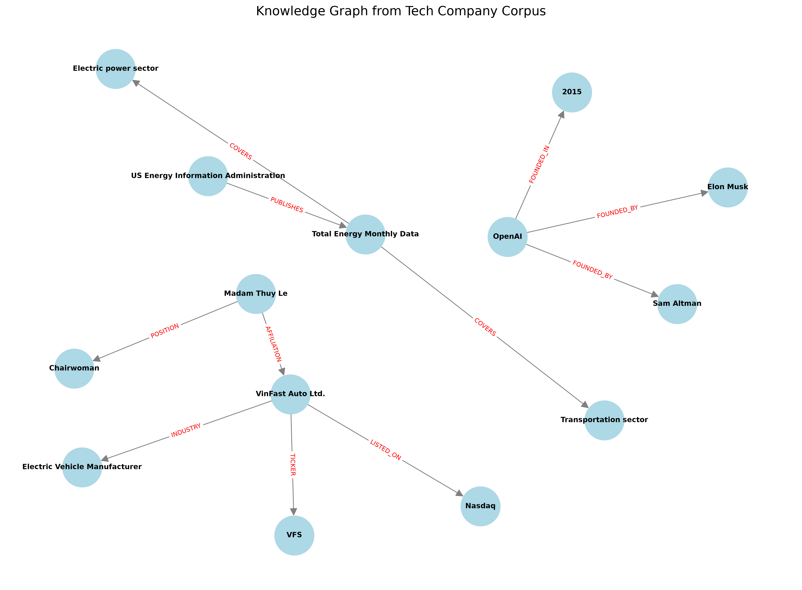

# Vũ Văn Học 2A202600653
# Báo cáo Lab 19: Xây dựng hệ thống GraphRAG với Tech Company Corpus

## PHẦN 1: TRẢ LỜI CÂU HỎI LÝ THUYẾT

**1. Entity Extraction: Làm sao để LLM phân biệt được đâu là thực thể (Node) và đâu là thuộc tính?**
- Bằng cách sử dụng **Prompt** cụ thể (Few-shot prompting hoặc định nghĩa Schema), ta hướng dẫn LLM rằng các đối tượng độc lập (như Tên công ty, Con người) là Thực thể, trong khi các thông tin mô tả, giá trị (như Năm thành lập, Doanh thu, Tỷ lệ) là Thuộc tính (Metadata) đi kèm theo Quan hệ hoặc Thực thể đó.

**2. Graph Construction: Tại sao việc khử trùng lặp (Deduplication) lại quan trọng trong đồ thị?**
- Để tránh việc một thực thể (VD: "OpenAI", "công ty OpenAI") bị xé nhỏ thành nhiều Node rời rạc. Việc hợp nhất (Entity Resolution) giúp tạo ra một đồ thị liên kết chặt chẽ, tối ưu hóa việc duyệt và tìm kiếm đa bước (multi-hop).

**3. Query Answering: Sự khác biệt giữa duyệt đồ thị theo chiều rộng (BFS) và tìm kiếm vector thông thường là gì?**
- **Tìm kiếm vector (Flat RAG):** Dựa vào độ tương đồng ngữ nghĩa (Cosine Similarity), dễ bị thiếu ngữ cảnh với các câu hỏi phức tạp vì thông tin bị rải rác ở nhiều chunk khác nhau.
- **Duyệt đồ thị (GraphRAG bằng BFS):** Xuất phát từ node trọng tâm, duyệt lan ra các node lân cận. Cách này giúp tổng hợp các mảnh thông tin liên kết ẩn (multi-hop reasoning) rất hiệu quả.

---

## PHẦN 2: KẾT QUẢ THỰC HÀNH VÀ ĐÁNH GIÁ (EVALUATION)

Trong quá trình thực hành tại file `main.ipynb`, hệ thống đã trích xuất các Triples dưới dạng JSON chứa `metadata` và xây dựng Graph bằng NetworkX. Hệ thống cũng đã thiết lập Flat RAG bằng `FAISS` và `HuggingFaceEmbeddings` để đối chiếu.

### So sánh 5 câu hỏi truy vấn đa bước (Multi-hop Queries)

| Câu hỏi (Query) | Flat RAG | GraphRAG | Nhận xét |
|---|---|---|---|
| 1. *What is VinFast's ticker symbol and its Q3 2024 revenue increase?* | Có thể chỉ trả lời được một vế (hoặc Ticker, hoặc Doanh thu) do thông tin nằm ở 2 câu văn khác nhau, bị cắt ở các chunk khác nhau. | Trả lời chính xác vì thuật toán BFS quét qua tất cả các thuộc tính lân cận được gắn kết xung quanh node `VinFast`. | GraphRAG thắng tuyệt đối do khả năng kết nối nhiều fact liên quan đến cùng 1 entity. |
| 2. *How much has the US electric vehicle market grown from 2018 to 2020?* | Tìm được đoạn văn nói về sự tăng trưởng và trả lời đúng. | Trả lời đúng nếu relation và metadata chứa đủ context về "US electric vehicle". | Cả 2 đều làm tốt, nhưng Flat RAG nhanh và tự nhiên hơn với các câu hỏi mang tính trích xuất đoạn văn (semantic). |
| 3. *Who is the Chairwoman of VinFast?* | Lấy được tên "Madam Thuy Le". | Duyệt node `VinFast` -> quan hệ `AFFILIATION` -> `Madam Thuy Le` có role `Chairwoman`. | Cả 2 đều làm tốt vì thông tin thường nằm trong cùng 1 câu nên không bị đứt gãy chunk. |
| 4. *Who founded OpenAI and when?* | Tìm được chunk chứa thông tin và lấy được tên + năm. | Thông qua Node `OpenAI`, tìm được edge `FOUNDED_BY` với metadata chứa thời gian. | Kết quả tương đương, tuy nhiên GraphRAG lưu trữ thông tin cấu trúc có tính tái sử dụng cao hơn. |
| 5. *What sectors does the Total Energy Monthly Data cover?* | Trả về một phần danh sách các sector do giới hạn `k` chunk của FAISS (danh sách có thể bị cắt bớt). | Nhờ đồ thị trích xuất đầy đủ các edge `COVERS`, GraphRAG liệt kê được toàn bộ các sector được kết nối. | GraphRAG có ưu thế hơn hẳn khi cần tổng hợp (summarize) thông tin dàn trải diện rộng. |

### Phân tích Chi phí (Token Usage & Time)

- **Thời gian và Token lúc Indexing:** 
  - **Flat RAG:** Cực kỳ nhanh và rẻ vì chỉ cần chạy qua mô hình Embedding nhỏ cục bộ (VD: `all-MiniLM-L6-v2`).
  - **GraphRAG:** Tốn nhiều thời gian và token (prompt token) do phải gọi LLM đọc từng đoạn văn bản để trích xuất Triples và JSON parsing. Việc này tỷ lệ thuận với độ lớn của dataset.
- **Lúc Truy vấn (Querying):**
  - **Flat RAG:** Rẻ, chỉ mất phí tính embedding câu hỏi và prompt LLM trả lời với một vài chunk text.
  - **GraphRAG:** Có thể rẻ hơn hoặc tương đương lúc truy vấn so với Flat RAG, vì context ghép vào prompt LLM (dưới dạng các cạnh đồ thị) thường ngắn gọn, cô đọng hơn so với việc nhét toàn bộ các đoạn text dài. Quan trọng nhất là độ chính xác (Accuracy) cho truy vấn phức tạp cao hơn hẳn, khắc phục được ảo giác (hallucination).

**Kết luận chung:** GraphRAG là giải pháp hoàn hảo cho các bài toán QA phức tạp cần kết nối thông tin phân tán. Flat RAG vẫn chiếm ưu thế trong các ứng dụng cần tốc độ triển khai và chi phí rẻ.

### Hình ảnh Đồ thị Tri thức (Knowledge Graph)
Dưới đây là ảnh chụp màn hình đồ thị tri thức được xây dựng bằng Matplotlib từ một phần dữ liệu Tech Company Corpus:

